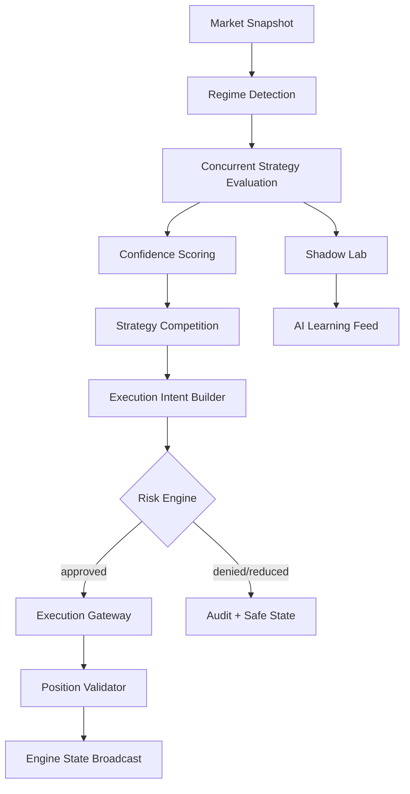
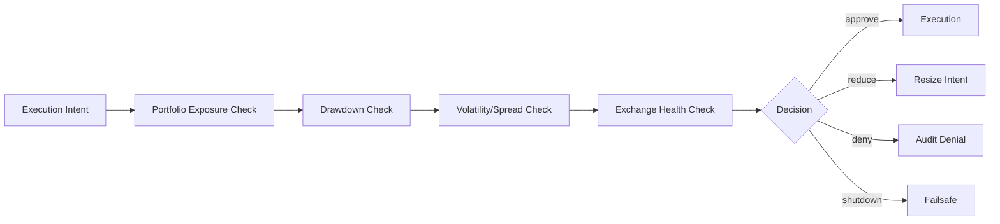

# LAPS HYBRID Adaptive Core Engine

## 1. Mission

The Adaptive Core Engine is the operational brain of LAPS HYBRID. It continuously converts market telemetry into controlled execution decisions while preserving a strict hierarchy:

1. Survival and capital protection
2. System integrity and exchange safety
3. Risk-adjusted opportunity capture
4. Learning and strategy evolution

The engine is not a fixed-rule trading bot. It is an asynchronous orchestration layer that coordinates market state, regime intelligence, live and shadow strategies, confidence scoring, risk overrides, execution, position validation, and learning feedback loops.

## 2. Folder and Module Structure

```text
backend/
  laps_hybrid/
    adaptive_core/
      __init__.py
      models.py               # Shared enums, dataclasses, and decision contracts
      orchestrator.py         # Main async orchestration loop
      strategies.py           # Strategy protocol and base class
      regime.py               # Market regime detection engine
      confidence.py           # AI-ready confidence scoring engine
      risk.py                 # Risk gatekeeper with override authority
      execution.py            # Exchange execution gateway contracts
      shadow.py               # Shadow-mode simulation and learning feed

docs/
  adaptive-core-engine.md     # Architecture and implementation guide

tests/
  test_adaptive_core.py       # Contract-level orchestration tests
```

Recommended future expansion:

```text
backend/
  laps_hybrid/
    api/
      v1/
        adaptive_core.py      # FastAPI control/status endpoints
        websocket.py          # Streaming state and strategy telemetry
    infrastructure/
      exchange/
        ccxt_gateway.py       # REST execution via CCXT
        native_ws.py          # Native exchange websocket streams
      persistence/
        models.py             # SQLAlchemy ORM models
        repositories.py       # PostgreSQL repositories
      cache/
        redis_bus.py          # Redis pub/sub and ephemeral state
    services/
      portfolio.py            # Position and wallet snapshots
      audit.py                # Immutable audit/event writer
      watchdog.py             # Health checks and failsafe triggers
```

## 3. Service Architecture

```text
Exchange WebSockets
        |
        v
Market Data Service -----> Redis Stream / PubSub -----> Adaptive Core Engine
                                                        |       |       |
                                                        |       |       +--> Shadow Strategy Lab
                                                        |       +----------> Risk Engine
                                                        +------------------> Strategy Competition
                                                                                 |
                                                                                 v
PostgreSQL <---- Audit/Event Log <---- Execution Gateway <---- Approved Intents
      ^                                      |
      |                                      v
Investor/Copy Trading Services <---- Position Validator
```

### Core runtime services

- **Market Data Service**: Normalizes ticker, book, trade, funding, open-interest, liquidation, dominance, and session data.
- **Adaptive Core Engine**: Coordinates every decision tick and enforces the regime -> strategy -> confidence -> risk -> execution sequence.
- **Market Regime Engine**: Classifies the market into trend, range, chaos, or dead-market mode.
- **Strategy Competition Engine**: Evaluates live and shadow strategies concurrently and ranks them by adjusted confidence.
- **Confidence Engine**: Combines market alignment, liquidity quality, volatility quality, correlation, spread, and recent strategy performance.
- **Risk Engine**: Has final veto authority over all execution intents.
- **Execution Gateway**: Translates approved intents into exchange-specific orders, with idempotency and post-order reconciliation.
- **Shadow Strategy Lab**: Simulates non-live strategies and feeds performance outcomes to AI scoring and strategy promotion workflows.
- **Audit Log**: Persists decisions, denials, score changes, signals, risk events, and execution results.

## 4. Main Orchestration Flow

Each engine tick performs:

1. Pull or receive the latest normalized market snapshot.
2. Detect market regime and operational mode.
3. Evaluate live and shadow strategies concurrently.
4. Score each strategy result using confidence inputs.
5. Select candidate live signals by score, regime compatibility, and strategy status.
6. Convert candidate signals into execution intents.
7. Submit intents to the Risk Engine.
8. Execute only risk-approved intents.
9. Update shadow simulations and learning metrics.
10. Validate positions against expected state.
11. Publish engine state to APIs, websockets, Redis, audit logs, and monitoring.



## 5. Async Architecture

The Adaptive Core is built around asynchronous dependency injection:

- `MarketDataProvider.latest_snapshot()` returns a normalized market snapshot.
- `PortfolioProvider.latest_positions()` returns current positions.
- `Strategy.evaluate()` runs independently for each strategy.
- `ExecutionGateway.execute()` executes approved intents.
- `AdaptiveCoreEngine.tick()` coordinates one deterministic decision cycle.
- `AdaptiveCoreEngine.run_forever()` runs the continuous loop with cancellation-safe shutdown.

Concurrency model:

- Market ingestion runs independently through exchange websocket services.
- Strategy evaluation runs via `asyncio.gather`.
- Shadow strategies are evaluated on every tick but never produce live orders.
- Risk evaluation is synchronous from the perspective of execution ordering: no order leaves the engine without risk approval.
- Execution may be concurrent by symbol/account only after idempotency and exposure checks are satisfied.

Failure containment:

- One strategy failure does not crash the engine tick.
- Failed strategies are scored as inactive and audited.
- Market-data staleness triggers safe mode.
- Risk engine denial is a normal outcome, not an exception.
- Cancellation propagates cleanly during deployment shutdown.

## 6. Strategy Interface Design

Every strategy exposes the same operational contract:

```python
class Strategy(Protocol):
    name: str
    mode: StrategyMode
    allowed_regimes: set[MarketRegime]

    async def evaluate(
        self,
        snapshot: MarketSnapshot,
        regime: RegimeAssessment,
    ) -> StrategyEvaluation:
        ...
```

### Strategy output requirements

Each evaluation returns:

- Strategy name
- Live or shadow mode
- Signal side: long, short, flat, or hedge
- Raw confidence
- Recent performance metrics
- Drawdown
- Sharpe-like efficiency
- Regime alignment
- Rationale
- Optional metadata for AI learning

### Supported strategy families

- Trend Following
- Scalping
- Momentum
- Breakout
- Mean Reversion
- Funding Capture
- Arbitrage
- Liquidity Sweep
- Session Scalping
- Volatility Expansion

### Promotion lifecycle

```text
candidate -> shadow -> probation_live -> active_live -> throttled -> retired
```

Promotion requires:

- Stable positive expectancy across multiple market regimes
- Acceptable drawdown
- Liquidity-aware fill assumptions
- Low slippage sensitivity
- Non-overlapping alpha compared with existing live strategies
- Approval by risk governance rules

## 7. Regime Engine Architecture

The Regime Engine evaluates the following normalized inputs:

- Volatility
- Volume
- Spread
- BTC dominance
- Momentum
- Funding rate
- Liquidation activity

It returns:

- Market regime
- Confidence
- Operational mode
- Leverage multiplier
- Aggressiveness multiplier
- Trade frequency multiplier
- Position size multiplier
- Allowed strategy families
- Explanation

### Regime personalities

| Regime | Behavior | Strategy Bias | Risk Posture |
| --- | --- | --- | --- |
| Trend Market | Directional continuation | Trend, momentum, breakout | Moderate risk, confirmation required |
| Range Market | Mean reverting structure | Mean reversion, scalping | Smaller size, tighter targets |
| Chaos Market | High volatility and stress | Hedge, defensive, volatility expansion only under strict filters | De-risk, reduce leverage, possible safe mode |
| Dead Market | Low volume and poor opportunity | Funding capture, selective scalping | Minimal trading, preserve capital |

### Regime decision principles

- Chaos overrides other regimes when liquidation, spread, and volatility stress are elevated.
- Dead-market detection suppresses overtrading in low-volume chop.
- Trend requires momentum confirmation and acceptable spread.
- Range is favored when momentum is weak but liquidity and volatility are tradeable.

## 8. Confidence Scoring Architecture

Confidence scoring uses a weighted model designed to be replaceable by AI/ML models later.

Inputs:

- Market alignment
- Volatility quality
- Liquidity quality
- BTC correlation quality
- Spread quality
- Strategy performance
- Recent win/loss behavior

Output:

- Final normalized confidence score
- Component-level score breakdown
- Rationale fields for auditing and model training

```text
final_score =
  market_alignment      * 0.25 +
  volatility_quality    * 0.15 +
  liquidity_quality     * 0.15 +
  btc_correlation       * 0.10 +
  spread_quality        * 0.10 +
  strategy_performance  * 0.15 +
  recent_behavior       * 0.10
```

Production extensions:

- Bayesian confidence updates per strategy/regime pair
- Online learning for market microstructure conditions
- Feature store backed by PostgreSQL and Redis
- Model versioning and reproducible score explanations
- Canary scoring before model promotion

## 9. Risk Priority Architecture

The Risk Engine has non-negotiable override authority. It can:

- Approve an intent
- Deny an intent
- Reduce position size
- Force safe mode
- Force emergency shutdown
- Request hedge-only behavior

Risk checks:

- Maximum portfolio exposure
- Symbol exposure
- Leverage cap
- Drawdown cap
- Volatility stress cap
- Liquidity and spread constraints
- Exchange health
- Market data freshness
- Investor-specific profile constraints
- Copy-trading proportional exposure caps



## 10. Shadow Mode Architecture

Shadow strategies run against live market data without real execution.

Responsibilities:

- Generate simulated entries and exits
- Estimate fills, slippage, and fees
- Track virtual PnL and drawdown
- Compare expected vs realized market movement
- Feed score history into the AI learning pipeline
- Recommend promotion, throttling, or retirement

Shadow mode must persist:

- Strategy version
- Input features
- Signal details
- Simulated order details
- Market regime at decision time
- Expected vs actual outcome
- Score breakdown
- Promotion status

Shadow strategy outputs are never passed to the live execution gateway. They are consumed by:

- Strategy ranking research
- AI confidence training
- Market-regime calibration
- Human review dashboards

## 11. Event Flow Diagrams

### Normal live execution

```text
market_snapshot.received
  -> regime.detected
  -> strategies.evaluated
  -> confidence.scored
  -> strategy.selected
  -> risk.approved
  -> order.submitted
  -> order.acknowledged
  -> position.validated
  -> state.broadcast
```

### Risk denial

```text
strategy.selected
  -> execution_intent.created
  -> risk.denied
  -> denial.audit_written
  -> strategy.cooldown_updated
  -> state.broadcast
```

### Market chaos escalation

```text
liquidation_spike.detected
  -> regime.chaos
  -> leverage.reduced
  -> live_strategy_set.restricted
  -> open_positions.hedge_or_reduce
  -> safe_mode.considered
```

### Shadow learning

```text
shadow_signal.generated
  -> simulated_trade.opened
  -> market_outcome.observed
  -> virtual_pnl.updated
  -> ai_score_sample.persisted
  -> promotion_metrics.refreshed
```

## 12. Service Interaction Design

### Adaptive Core dependencies

| Dependency | Purpose |
| --- | --- |
| MarketDataProvider | Supplies normalized market snapshots from exchange websockets and Redis |
| PortfolioProvider | Supplies position, wallet, exposure, and drawdown state |
| Strategy registry | Supplies live and shadow strategy instances |
| RegimeEngine | Classifies market state and operating personality |
| ConfidenceEngine | Scores strategy outputs |
| RiskEngine | Approves, reduces, denies, or shuts down execution |
| ExecutionGateway | Sends approved orders to exchange adapters |
| ShadowStrategyLab | Captures simulated performance |
| Audit/Event Publisher | Persists immutable decision traces |
| Websocket Broadcaster | Streams state to external frontends |

### API integration points

FastAPI should expose control-plane endpoints only:

- `GET /api/v1/adaptive-core/state`
- `GET /api/v1/adaptive-core/regime`
- `GET /api/v1/adaptive-core/strategies`
- `POST /api/v1/adaptive-core/safe-mode`
- `POST /api/v1/adaptive-core/resume`
- `POST /api/v1/adaptive-core/strategies/{name}/mode`

External frontends connect over websocket:

- `/ws/v1/engine/state`
- `/ws/v1/engine/strategies`
- `/ws/v1/engine/risk`
- `/ws/v1/market/regime`

The frontend remains fully separate from the backend.

## 13. Persistence Planning

Minimum PostgreSQL tables for the Adaptive Core:

### `market_states`

- `id`
- `symbol`
- `timestamp`
- `regime`
- `regime_confidence`
- `volatility`
- `volume`
- `spread`
- `btc_dominance`
- `momentum`
- `funding_rate`
- `liquidation_intensity`
- `raw_payload`

### `strategy_evaluations`

- `id`
- `strategy_name`
- `strategy_version`
- `mode`
- `symbol`
- `timestamp`
- `regime`
- `signal_side`
- `raw_confidence`
- `final_confidence`
- `drawdown`
- `efficiency_score`
- `recent_win_rate`
- `metadata`

### `risk_decisions`

- `id`
- `strategy_evaluation_id`
- `decision`
- `reason`
- `requested_notional`
- `approved_notional`
- `leverage`
- `portfolio_exposure`
- `symbol_exposure`
- `drawdown`
- `exchange_health`
- `created_at`

### `execution_intents`

- `id`
- `strategy_name`
- `symbol`
- `side`
- `notional`
- `leverage`
- `confidence`
- `status`
- `idempotency_key`
- `created_at`

### `shadow_trades`

- `id`
- `strategy_name`
- `strategy_version`
- `symbol`
- `side`
- `entry_price`
- `exit_price`
- `simulated_size`
- `fees`
- `slippage`
- `pnl`
- `regime`
- `opened_at`
- `closed_at`

### `engine_events`

- `id`
- `event_type`
- `severity`
- `correlation_id`
- `payload`
- `created_at`

## 14. Deployment and Scaling Considerations

### Runtime separation

- Run market ingestion, adaptive core, execution workers, API server, and websocket broadcaster as separate containers.
- Use Redis streams for low-latency event distribution.
- Use PostgreSQL for durable decisions and audit trails.
- Use separate exchange execution workers per exchange/account group.

### Horizontal scaling

- Scale market-data consumers by exchange and symbol shard.
- Scale strategy evaluators by symbol universe and strategy family.
- Keep execution serialized per account/symbol to avoid order race conditions.
- Use Redis locks or database advisory locks for order idempotency.

### Reliability

- Engine state should be reconstructable from durable events.
- Every execution intent must include an idempotency key.
- Websocket drops must not affect core decision making.
- Market-data staleness triggers safe mode.
- Exchange adapter failure triggers cancel/reconcile workflows.

## 15. Suggested Implementation Order

1. Define core contracts and dataclasses.
2. Implement market snapshot ingestion contract.
3. Implement regime engine with deterministic heuristics.
4. Implement strategy interface and first mock/live strategy.
5. Implement confidence scoring.
6. Implement risk engine with hard survival constraints.
7. Implement execution gateway abstraction and no-op gateway.
8. Add shadow strategy simulator.
9. Add audit/event persistence.
10. Add FastAPI control-plane endpoints.
11. Add websocket state broadcasts.
12. Add native exchange websocket adapters.
13. Add CCXT execution adapters.
14. Add PostgreSQL repositories and Alembic migrations.
15. Add AI model feature store and model promotion governance.

## 16. Production Readiness Checklist

- No order can bypass risk validation.
- No strategy failure can crash the orchestration loop.
- No shadow strategy can send live orders.
- Market data staleness is detected and handled.
- Every decision has an audit record.
- Every order has an idempotency key.
- Exchange state is reconciled against internal state.
- Safe mode and emergency shutdown are explicit states.
- Copy-trading sizing is calculated after master intent approval and before subaccount execution.
- Investor risk profiles can only reduce risk relative to master settings.
