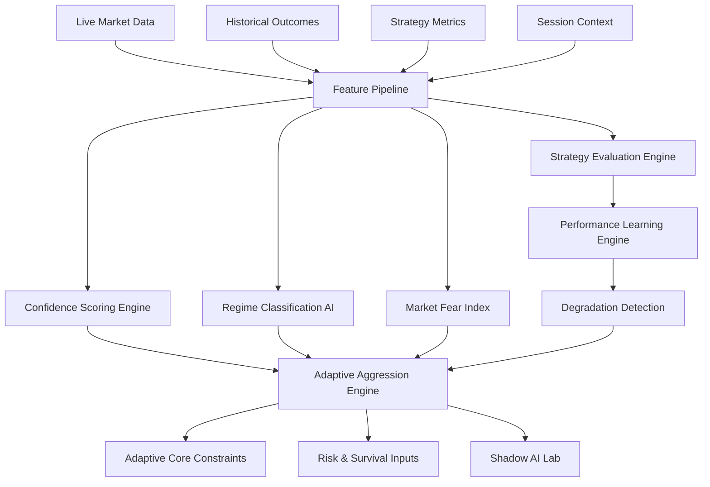
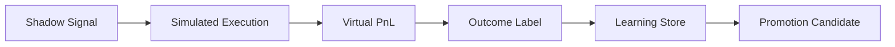

# LAPS HYBRID AI Intelligence & Learning System

## 1. Mission

The AI Intelligence & Learning System is the adaptive intelligence layer of LAPS HYBRID. It is not a prediction-only model. It continuously evaluates market behavior, strategy quality, regime compatibility, session context, market fear, and operational degradation so the platform can adapt risk, strategy priority, aggressiveness, leverage, position sizing, and execution posture.

Core hierarchy:

```text
SURVIVAL > ADAPTATION > EXPLAINABILITY > PERFORMANCE > PREDICTION
```

The system may recommend expansion, throttling, shadow-mode promotion, or temporary disablement, but it cannot override the Risk & Survival Engine.

## 2. System Architecture



### Core components

- **Confidence Scoring Engine**: scores live strategy/market alignment with auditable components.
- **Strategy Evaluation Engine**: ranks strategy quality by performance, drawdown, efficiency, regime/session compatibility, and recent behavior.
- **Market Behavior Analysis**: transforms live market structure, liquidity, volatility, funding, orderflow, and BTC alignment into features.
- **Performance Learning Engine**: updates strategy/regime/session performance history.
- **Regime Classification AI**: classifies trend, range, chaos, and dead-market conditions with explainable evidence.
- **Strategy Degradation Detection**: detects confidence decay, drawdown acceleration, loss streaks, slippage drift, and regime mismatch.
- **Volatility Intelligence**: distinguishes useful volatility from chaotic volatility.
- **Session Intelligence**: learns Asia, Europe, and US session behavior and adapts strategy selection.
- **Market Fear Index**: quantifies internal stress from liquidations, spread expansion, abnormal volatility, orderflow aggression, funding instability, and BTC dominance shocks.
- **Adaptive Aggression Engine**: converts intelligence outputs into operational aggression, leverage, size, frequency, and allowed strategy recommendations.

## 3. Learning Pipeline Structure

```text
ingest -> normalize -> feature_build -> score -> decide -> persist -> learn -> calibrate
```

### Data sources

- Exchange websocket market data
- Orderbook snapshots
- Funding rates
- Liquidation feeds
- BTC dominance and correlation inputs
- Strategy evaluations
- Execution outcomes
- Shadow strategy simulations
- Session performance history
- Risk and safe-mode events

### Pipeline stages

1. **Ingestion**: consume raw events from Redis streams, websocket managers, and PostgreSQL repositories.
2. **Normalization**: convert exchange-specific data to stable feature contracts.
3. **Feature building**: compute volatility quality, liquidity quality, spread quality, trend consistency, BTC alignment, session context, and fear components.
4. **Scoring**: produce confidence, strategy quality, degradation, and fear scores.
5. **Decisioning**: create adaptive aggression recommendations.
6. **Persistence**: store score history, feature snapshots, decisions, and explanations.
7. **Learning**: update rolling strategy/regime/session performance.
8. **Calibration**: compare predicted confidence against realized outcome and adjust weights or model versions.

## 4. Confidence Engine Design

Confidence scoring is dynamic and explainable.

Inputs:

- Volatility quality
- Liquidity quality
- Spread conditions
- BTC alignment
- Trend consistency
- Strategy historical performance
- Recent win/loss behavior
- Market structure
- Session behavior

Outputs:

- Final confidence score
- Component score breakdown
- Minimum recommended confidence threshold
- Strategy priority multiplier
- Rationale for audit and model training

```text
confidence =
  volatility_quality      * 0.14 +
  liquidity_quality       * 0.12 +
  spread_quality          * 0.10 +
  btc_alignment           * 0.10 +
  trend_consistency       * 0.13 +
  historical_performance  * 0.17 +
  recent_behavior         * 0.12 +
  market_structure        * 0.07 +
  session_behavior        * 0.05
```

Influences:

- Leverage
- Position size
- Execution aggressiveness
- Allowed strategies
- Shadow-to-live promotion decisions

## 5. Strategy Evaluation Flow

```text
strategy.metrics_received
  -> regime_compatibility.scored
  -> volatility_compatibility.scored
  -> session_compatibility.scored
  -> performance_quality.scored
  -> degradation_checked
  -> priority_updated
  -> live/shadow/disabled recommendation emitted
```

Metrics:

- Win rate
- Drawdown
- Sharpe-like efficiency
- Profit factor
- Recent loss streak
- Slippage drift
- Market compatibility
- Volatility compatibility
- Session compatibility

Possible recommendations:

- Increase priority
- Maintain priority
- Reduce priority
- Move to shadow mode
- Temporarily disable

Strategies must earn live capital allocation continuously. Past success does not grant permanent priority.

## 6. Shadow AI Lab Architecture

Shadow strategies simulate execution without capital risk.

Responsibilities:

- Run candidate and disabled strategies against live market data.
- Simulate entries, exits, fees, slippage, and partial fills.
- Store feature snapshots and outcomes.
- Compare shadow performance against live strategies.
- Recommend promotion only after stable, risk-adjusted evidence.



Promotion requirements:

- Positive expectancy across enough samples
- Controlled drawdown
- Regime compatibility
- Session compatibility
- Slippage tolerance
- Low correlation with existing live alpha
- Risk governance approval

## 7. Market Fear Index Structure

The Market Fear Index is an internal stress gauge. It does not forecast direction; it estimates systemic danger.

Inputs:

- Liquidation intensity
- Spread expansion
- Abnormal volatility
- Aggressive orderflow
- Funding instability
- BTC dominance spikes

Outputs:

- Fear score from 0 to 1
- Fear state: calm, elevated, stressed, panic
- Exposure multiplier
- Leverage multiplier
- Safe-mode signal

```text
fear =
  liquidations       * 0.24 +
  spread_expansion   * 0.16 +
  abnormal_volatility* 0.20 +
  orderflow_aggression*0.12 +
  funding_instability*0.13 +
  btc_dominance_shock*0.15
```

Fear effects:

- High fear reduces global exposure.
- Panic fear can request survival/lockdown review.
- Elevated fear raises minimum confidence thresholds.
- Fear history is used to calibrate chaos-regime detection.

## 8. Session Intelligence Design

Supported sessions:

- Asia
- Europe
- US
- Overlap windows

Session Intelligence evaluates:

- Expected volatility
- Liquidity quality
- Spread behavior
- Strategy win rate by session
- Slippage by session
- Funding/event sensitivity
- Session transition risk

Adaptation examples:

- Asia low-liquidity conditions may reduce breakout aggressiveness.
- Europe open may increase volatility expectations.
- US session may permit higher liquidity but tighter risk controls around news shocks.
- Session overlaps may increase opportunity and instability simultaneously.

## 9. Adaptive Aggression Flow

Adaptive aggression converts intelligence into operational behavior.

```text
confidence_scores
  + fear_index
  + degradation_state
  + regime_state
  + session_state
  -> aggression_score
  -> leverage_multiplier
  -> position_size_multiplier
  -> execution_aggressiveness
  -> allowed_strategy_bias
```

Aggression states:

- **Defensive**: reduce exposure, high confidence only.
- **Normal**: standard controlled operation.
- **Expanded**: controlled expansion in high-quality conditions.
- **Suppressed**: degradation or fear limits new risk.

Examples:

- Strong trend, low fear, healthy strategy -> controlled expansion.
- Unstable market, high fear -> defensive/suppressed.
- Degrading performance -> reduced exposure or shadow mode.
- Session mismatch -> lower strategy priority.

## 10. Data Storage Planning

Recommended PostgreSQL tables:

### `ai_feature_snapshots`

- `id`
- `symbol`
- `timestamp`
- `volatility_quality`
- `liquidity_quality`
- `spread_quality`
- `btc_alignment`
- `trend_consistency`
- `market_structure`
- `session`
- `raw_features`

### `ai_confidence_history`

- `id`
- `strategy_name`
- `symbol`
- `regime`
- `session`
- `final_score`
- `component_breakdown`
- `model_version`
- `created_at`

### `ai_strategy_metrics`

- `id`
- `strategy_name`
- `strategy_version`
- `win_rate`
- `drawdown`
- `sharpe_like`
- `profit_factor`
- `slippage_bps`
- `regime`
- `session`
- `sample_size`
- `created_at`

### `ai_regime_history`

- `id`
- `symbol`
- `regime`
- `confidence`
- `evidence`
- `created_at`

### `ai_fear_index_history`

- `id`
- `symbol`
- `fear_score`
- `fear_state`
- `component_breakdown`
- `safe_mode_signal`
- `created_at`

### `ai_degradation_events`

- `id`
- `strategy_name`
- `severity`
- `reason`
- `recommended_action`
- `metrics_snapshot`
- `created_at`

### `ai_decisions`

- `id`
- `decision_type`
- `target`
- `recommendation`
- `confidence`
- `reason`
- `model_version`
- `created_at`

## 11. Suggested Implementation Roadmap

1. Define AI feature, score, session, fear, and strategy evaluation contracts.
2. Implement explainable confidence scoring.
3. Implement strategy evaluation and degradation detection.
4. Implement Market Fear Index.
5. Implement Session Intelligence.
6. Implement Adaptive Aggression Engine.
7. Implement Shadow AI Lab metric capture.
8. Persist feature snapshots and AI decisions.
9. Integrate AI outputs into Adaptive Core constraints.
10. Integrate fear and degradation outputs into Risk & Survival Engine.
11. Add model versioning and calibration reports.
12. Add offline backtesting and shadow-vs-live comparison.
13. Add feature store and long-horizon historical learning.
14. Add guarded ML models after deterministic scoring is stable.
15. Add operator dashboards for score explanations and degradation events.

## 12. Production Readiness Rules

- AI cannot override risk lockdown.
- Every AI score must be explainable.
- Every model version must be traceable.
- Shadow strategies cannot receive live capital automatically.
- Degraded strategies must lose priority before causing systemic damage.
- Fear index must reduce exposure, not increase it.
- Strategy promotion requires enough samples and risk governance approval.
- AI decisions must be persisted for audit and post-trade review.
