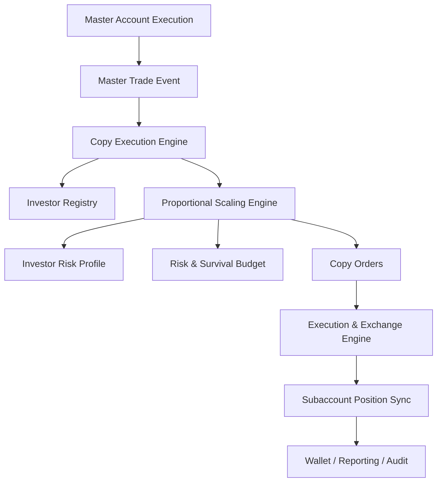
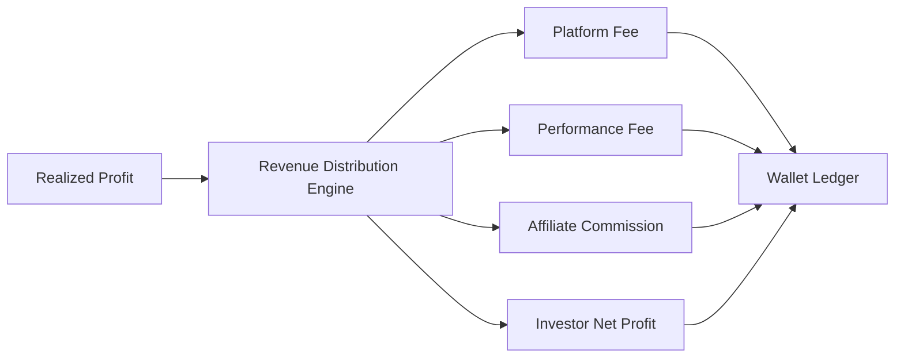

# LAPS HYBRID Copy Trading & Investor Ecosystem

## 1. Mission

The Copy Trading & Investor Ecosystem transforms LAPS HYBRID from a single-account trading system into scalable investor infrastructure. It coordinates a master trading account, investor subaccounts, proportional replication, investor-specific risk DNA, wallet accounting, revenue distribution, referral commissions, investor APIs, security, and immutable audit trails.

The ecosystem is designed as fintech infrastructure, not a simple copy-trading bot.

Core principles:

```text
INVESTOR SAFETY > CONSISTENCY > ISOLATION > SCALE > REVENUE
```

No investor replication may bypass:

- Risk & Survival Engine constraints
- Investor DNA limits
- Subaccount permissions
- Exchange execution validation
- Wallet/accounting auditability

## 2. Service and Module Structure

```text
backend/
  laps_hybrid/
    copy_trading/
      __init__.py
      models.py             # Investor, master trade, copy order, wallet, revenue contracts
      scaling.py            # Proportional exposure and investor DNA scaling
      engine.py             # Copy execution orchestration from master trade to subaccounts
      synchronization.py    # Subaccount local-vs-exchange position consistency checks
      revenue.py            # Configurable platform/performance/affiliate distribution
      referral.py           # Referral tracking, recurring commission, payout history
      wallet.py             # Investor wallet ledger and balance accounting
      audit.py              # Investor action and compliance audit sink

docs/
  copy-trading-investor-ecosystem.md
```

Recommended production expansion:

```text
backend/
  laps_hybrid/
    api/
      v1/
        investors.py
        investor_dashboard.py
        referrals.py
        wallets.py
    services/
      copy_execution_worker.py
      investor_reporting_worker.py
      revenue_distribution_worker.py
      referral_payout_worker.py
    infrastructure/
      persistence/
        investor_repository.py
        wallet_repository.py
        referral_repository.py
        copy_trade_repository.py
      security/
        investor_auth.py
        permissions.py
        key_vault.py
```

## 3. Copy Trading Architecture



### Core services

- **Master Trading Account Service**: emits validated master trade events only after execution state is confirmed.
- **Investor Registry**: stores investor profile, subaccount ID, status, permissions, risk DNA, and strategy participation.
- **Copy Execution Engine**: converts one master trade into investor-specific copy orders.
- **Proportional Scaling Engine**: calculates exposure based on master risk fraction, investor equity, DNA, leverage, drawdown, and strategy permissions.
- **Subaccount Synchronization Service**: validates expected investor positions against exchange state.
- **Revenue Distribution Service**: calculates configurable fees and commissions.
- **Referral/Affiliate Service**: tracks referral trees, recurring commissions, payout state, and history.
- **Wallet Ledger Service**: records deposits, withdrawals, transfers, fees, distributions, and commission payouts.
- **Investor Dashboard API**: exposes read-only investor state and controlled account actions.
- **Audit & Compliance Log**: immutable investor-related event history.

## 4. Investor Ecosystem Architecture

Investor lifecycle:

```text
lead -> registered -> KYC/approval -> funded -> active -> suspended -> closed
```

Investor entities:

- Investor identity
- Authentication account
- Subaccount/exchange account mapping
- Wallet ledger
- Risk profile
- Strategy participation permissions
- Referral attribution
- Profit-sharing configuration
- Audit history

### Investor DNA profiles

| Profile | Leverage | Exposure | Drawdown | Frequency | Strategy Participation |
| --- | --- | --- | --- | --- | --- |
| Conservative | Lowest | Lowest | Lowest | Reduced | Only lower-volatility approved strategies |
| Balanced | Moderate | Moderate | Moderate | Standard | Standard approved strategies |
| Aggressive | Highest allowed | Highest allowed | Higher cap | Higher but throttled | Broader participation under risk controls |

Investor DNA can only reduce or cap risk relative to global platform limits. It cannot override safe mode, lockdown, execution failsafe, or exchange desync restrictions.

## 5. Subaccount Synchronization Flow

```text
copy_order.created
  -> execution_engine.submits_subaccount_order
  -> order_update.validated
  -> partial_fill.accounted
  -> expected_position.updated
  -> exchange_position.fetched_or_streamed
  -> reconciliation.compared
  -> mismatch.classified
  -> repair_or_safe_mode.triggered
```

Detected synchronization issues:

- Missing investor position
- Ghost investor position
- Quantity mismatch
- Leverage mismatch
- Hedge-side mismatch
- Partial-fill drift
- Unconfirmed exchange update
- Stale subaccount stream

Repair actions:

- Poll exchange state.
- Cancel stale subaccount orders.
- Recalculate expected position from validated fills.
- Submit reduce-only correction where safe.
- Pause investor copy trading.
- Escalate to survival/lockdown for affected investor.

## 6. Proportional Scaling Logic

Master trade replication is based on risk equivalence, not blind notional matching.

```text
master_risk_fraction = master_trade_notional / master_equity

investor_base_notional =
  investor_equity
  * master_risk_fraction
  * investor_profile.exposure_multiplier

investor_notional =
  investor_base_notional
  * strategy_participation_multiplier
  * drawdown_multiplier
  * platform_safe_mode_multiplier
```

Additional caps:

- Investor maximum leverage
- Investor max notional per trade
- Investor max portfolio exposure
- Investor max drawdown
- Allowed strategy family
- Trade frequency budget
- Subaccount available balance

Example:

```text
Master equity: 1,000,000
Master trade notional: 20,000
Master risk fraction: 2%

Investor equity: 50,000
Balanced exposure multiplier: 0.70
Investor base notional: 50,000 * 2% * 0.70 = 700
```

Partial fills are scaled by fill ratio:

```text
investor_target_fill = investor_target_quantity * master_fill_ratio
```

## 7. Revenue Distribution Architecture

Revenue distribution is configurable and versioned. Percentages must not be hardcoded.

Supported components:

- Platform management fee
- Performance fee
- Affiliate/referral commission
- Investor net profit allocation
- Commission payout reserve
- Reporting and tax export records



Configuration model:

- Rule ID
- Effective date
- Investor segment
- Platform fee rate
- Performance fee rate
- Affiliate commission rate
- High-water mark behavior
- Minimum payout threshold
- Payout currency

All distribution calculations must persist:

- Input profit
- Rule version
- Fee components
- Net investor amount
- Affiliate attribution
- Ledger transaction IDs

## 8. Referral System Structure

The referral system is built for multi-level support even if the first release uses one level.

Entities:

- Referrer
- Referred investor
- Referral code
- Attribution source
- Commission rule
- Commission accrual
- Commission payout
- Payout status

Flow:

```text
investor.registered_with_code
  -> referral.attributed
  -> investor.generates_profit_or_fee
  -> commission.calculated
  -> commission.ledgered
  -> payout.threshold_checked
  -> payout.processed
```

Requirements:

- Referral history is immutable.
- Commission rules are versioned.
- Recurring commissions are supported.
- Multi-level referral trees can be added without schema redesign.
- Payout tracking supports pending, approved, paid, failed, and reversed states.

## 9. Investor Dashboard API Planning

Frontend remains separate. Backend exposes APIs only.

### Account and dashboard

- `GET /api/v1/investors/me`
- `GET /api/v1/investors/me/dashboard`
- `GET /api/v1/investors/me/risk`
- `GET /api/v1/investors/me/performance`

Dashboard response includes:

- Current balance
- Equity
- Open positions
- Realized PnL
- Unrealized PnL
- Risk status
- Current market regime
- Active strategies
- AI confidence state
- Performance history

### Wallet

- `GET /api/v1/investors/me/wallet`
- `GET /api/v1/investors/me/wallet/transactions`
- `POST /api/v1/investors/me/withdrawals`

### Referrals

- `GET /api/v1/investors/me/referrals`
- `GET /api/v1/investors/me/referrals/commissions`

### Admin/operator

- `GET /api/v1/admin/investors`
- `POST /api/v1/admin/investors/{id}/suspend`
- `POST /api/v1/admin/investors/{id}/risk-profile`
- `GET /api/v1/admin/copy-trading/status`
- `GET /api/v1/admin/revenue-distributions`

## 10. Wallet Tracking Architecture

Wallet ledger tracks every investor balance-affecting event:

- Deposits
- Withdrawals
- Transfers
- Trading fees
- Platform fees
- Performance fees
- Profit distributions
- Affiliate commissions
- Commission payouts
- Reversals and corrections

Ledger rules:

- Append-only.
- Every transaction has a type, amount, currency, reference ID, and correlation ID.
- Balance is derived from ledger entries.
- Corrections are reversing entries, not mutation.
- Withdrawals require permission checks and risk-state checks.

## 11. Security Model

### Authentication

- JWT access tokens with short expiration.
- Refresh tokens stored securely and revocable.
- MFA readiness for investors and required MFA for operators.

### Authorization

- Investor can only access their own subaccount, wallet, and reporting.
- Operator access is role-based and audited.
- Admin actions require scoped permissions.
- Service-to-service calls use signed internal tokens or mTLS.

### Sensitive data

- API keys encrypted at rest.
- Secrets stored in a vault or cloud secret manager.
- Exchange keys scoped to subaccount permissions.
- Withdrawal addresses require verification and cooldown.
- PII encrypted and access audited.

### API protection

- Rate limiting per investor and IP.
- Request signing for sensitive actions.
- Idempotency keys for withdrawals and revenue payouts.
- Audit records for every investor-affecting action.

## 12. Scalability Planning

### Hundreds of investors

- One copy execution worker can fan out master trades to investor batches.
- Redis streams carry master trade and copy order events.
- PostgreSQL stores durable investor/account state.
- Execution workers shard by exchange and investor subaccount.

### Thousands of investors

- Partition investors by account group, exchange, or risk profile.
- Use queue-based fanout with backpressure.
- Batch read market/risk state; do not recompute global state per investor.
- Serialize execution per investor subaccount and symbol.
- Use per-investor idempotency keys for copy orders.
- Store dashboard aggregates asynchronously.

### Isolation

- Investor failures do not halt master trading.
- One subaccount desync pauses that investor, not all investors.
- Systemic exchange failure escalates globally.
- Revenue and wallet services are isolated from execution workers.

## 13. Audit System Structure

Investor audit events:

- API login/action
- Investor profile changes
- Risk profile changes
- Copy trade creation
- Copy execution update
- Balance change
- Deposit confirmation
- Withdrawal request/approval/payment
- Profit distribution
- Referral attribution
- Commission accrual/payout
- Subaccount desync/recovery

Audit fields:

- Timestamp
- Actor ID
- Actor type
- Investor ID
- Action
- Resource type
- Resource ID
- Correlation ID
- IP/device metadata where applicable
- Before/after state references
- Human-readable reason

## 14. Database Planning

Recommended PostgreSQL tables:

- `investors`
- `investor_subaccounts`
- `investor_risk_profiles`
- `master_trades`
- `copy_trades`
- `copy_order_fills`
- `investor_positions`
- `investor_wallet_transactions`
- `revenue_rules`
- `profit_distributions`
- `referral_accounts`
- `referral_commissions`
- `referral_payouts`
- `investor_dashboard_snapshots`
- `investor_audit_events`

All financial tables should include:

- `id`
- `investor_id`
- `correlation_id`
- `created_at`
- immutable amount/currency fields
- status
- metadata JSONB

## 15. Suggested Implementation Roadmap

1. Define investor, subaccount, copy trade, wallet, referral, and revenue contracts.
2. Implement proportional scaling engine.
3. Implement copy execution orchestration with paper execution integration.
4. Implement subaccount synchronization and desync classification.
5. Implement append-only wallet ledger.
6. Implement configurable revenue distribution rules.
7. Implement referral attribution and commission accrual.
8. Add PostgreSQL repositories and Alembic migrations.
9. Add FastAPI dashboard and wallet endpoints.
10. Add JWT authentication and investor permission isolation.
11. Add Redis stream fanout for copy execution.
12. Add admin/operator controls for investor suspension and risk profile changes.
13. Add payout workflows with idempotency and approval states.
14. Add reporting snapshots and websocket investor dashboards.
15. Add load tests for hundreds and thousands of investors.

## 16. Production Readiness Rules

- No investor copy order without investor-specific risk scaling.
- No subaccount execution without idempotency.
- No investor can receive more exposure than allowed by profile and safe mode.
- No revenue percentage is hardcoded in business logic.
- No wallet balance is mutated directly; ledger entries are append-only.
- No referral commission is paid without persisted attribution and rule version.
- No dashboard data bypasses investor authorization checks.
- No investor desync may continue copying until reconciliation clears.
- Every investor-affecting action must be auditable.
