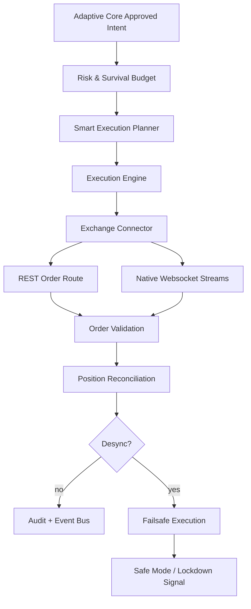
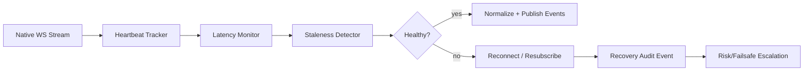

# LAPS HYBRID Execution & Exchange Engine

## 1. Mission

The Execution & Exchange Engine is the real-world market interface for LAPS HYBRID. Its purpose is reliable, validated, low-latency, exchange-synchronized execution under strict safety controls.

This layer must never behave like a retail bot that blindly trusts REST responses. Every order, fill, position, balance, stream, and exchange state transition is validated, reconciled, audited, and eligible for failsafe escalation.

Execution hierarchy:

```text
SAFETY > SYNCHRONIZATION > VALIDATION > LATENCY > FILL QUALITY
```

Supported first-class exchanges:

- Binance Futures
- Bitget Futures

Future connector targets:

- Bybit
- OKX
- KuCoin Futures

## 2. Service and Module Structure

```text
backend/
  laps_hybrid/
    execution_exchange/
      __init__.py
      models.py            # Orders, fills, positions, events, connector contracts
      connectors.py        # Exchange connector protocol and Binance/Bitget adapters
      websocket.py         # Stream state, heartbeat, staleness, reconnect decisions
      smart_execution.py   # Slippage/spread/liquidity-aware execution planning
      validation.py        # Order lifecycle validation and duplicate detection
      reconciliation.py    # Local-vs-exchange position reconciliation
      event_bus.py         # Event sink and in-memory publisher contract
      audit.py             # Structured execution audit records
      failsafe.py          # Execution instability response decisions
      engine.py            # Main orchestration service for safe execution

docs/
  execution-exchange-engine.md
```

Production expansion:

```text
backend/
  laps_hybrid/
    infrastructure/
      exchange/
        binance_futures_rest.py
        binance_futures_ws.py
        bitget_futures_rest.py
        bitget_futures_ws.py
        bybit_futures_rest.py
        okx_futures_rest.py
        kucoin_futures_rest.py
      persistence/
        execution_repository.py
        order_repository.py
        reconciliation_repository.py
      cache/
        order_state_cache.py
        market_depth_cache.py
```

## 3. Execution Engine Architecture



### Responsibilities

- Route approved execution intents to exchange-specific connectors.
- Validate accepted, filled, partial, rejected, canceled, stale, and duplicated order states.
- Track full order lifecycle.
- Maintain local execution state.
- Reconcile local state against exchange positions and balances.
- Prioritize BTC defense hedges.
- Detect websocket staleness and stream recovery requirements.
- Emit event-driven order, fill, position, funding, liquidation, and reconciliation events.
- Produce immutable audit records for all execution actions.

## 4. Exchange Connector Structure

Every exchange connector implements one futures contract:

```python
class ExchangeConnector(Protocol):
    exchange: Exchange

    async def place_order(self, request: OrderRequest) -> ExchangeOrderUpdate: ...
    async def cancel_order(self, exchange_order_id: str, symbol: str) -> ExchangeOrderUpdate: ...
    async def fetch_order(self, exchange_order_id: str, symbol: str) -> ExchangeOrderUpdate: ...
    async def fetch_positions(self) -> tuple[ExchangePosition, ...]: ...
    async def fetch_balances(self) -> dict[str, float]: ...
```

### Connector rules

- Translate LAPS orders into exchange-specific REST payloads.
- Maintain idempotency through `client_order_id`.
- Normalize exchange responses into internal models.
- Never expose raw exchange-specific response structures to core logic except in audit metadata.
- Surface latency and response timestamps.
- Mark uncertain responses explicitly.

### Binance Futures connector

Required channels:

- User data stream
- Futures order updates
- Account/position updates
- Mark price and funding
- Orderbook depth
- Aggregate trades
- Liquidation stream

### Bitget Futures connector

Required channels:

- Private order stream
- Private position stream
- Private account stream
- Public orderbook
- Funding rate
- Trades
- Liquidation or forced-order feed where available

## 5. Websocket Manager Architecture

The websocket layer is independent from the order route. REST order success does not imply stream health.



Features:

- Auto reconnect with capped exponential backoff.
- Heartbeat monitoring per stream.
- Stale connection detection.
- Message latency tracking.
- Sequence gap detection where exchange supports sequence IDs.
- Stream recovery and resubscription.
- Separate public and private stream health.
- Safe-mode escalation when private execution streams fail.

## 6. Order Execution Flow

```text
approved_intent.received
  -> risk_budget.applied
  -> smart_execution.plan_created
  -> client_order_id.generated
  -> order.submitted_via_connector
  -> rest_response.normalized
  -> order.acceptance_validated
  -> private_ws_update.awaited_or_order_polled
  -> partial_or_full_fill.validated
  -> position_reconciliation.scheduled
  -> lifecycle_event.audit_written
```

Supported order types:

- Market
- Limit
- Post-only
- Reduce-only
- Stop-market
- Take-profit

Supported execution priorities:

- Normal
- Urgent
- Hedge
- Liquidation defense

Hedge and liquidation defense orders bypass nonessential execution splitting but do not bypass risk, idempotency, or validation.

## 7. Execution Validation

The engine validates all order states from REST and websocket sources.

Validation checks:

- Order was accepted by the exchange.
- Client order ID is unique and not reused incorrectly.
- Duplicate fills are ignored.
- Partial fill quantity never exceeds requested quantity.
- Filled quantity, average price, and status are coherent.
- Rejected and canceled states are terminal.
- Stale orders are detected.
- REST response and websocket stream converge.

Order state model:

```text
created -> submitted -> accepted -> partially_filled -> filled
                        |           -> canceled
                        |           -> rejected
                        -> stale
                        -> unknown
```

Unknown states trigger polling and may escalate to failsafe if not resolved.

## 8. Position Reconciliation Flow

The reconciliation system continuously compares local state against exchange truth.

```text
local_positions.loaded
  -> exchange_positions.fetched
  -> compare.symbols
  -> compare.quantity
  -> compare.leverage
  -> compare.hedge_side
  -> classify_mismatch
  -> emit.reconciliation_alert
  -> trigger.failsafe_if_severe
```

Detects:

- Missing positions
- Ghost positions
- Quantity mismatch
- Leverage mismatch
- Hedge-side mismatch
- Stale local position
- Unknown exchange position

Severity rules:

- Missing or ghost positions are severe.
- Hedge mismatch is severe during hedge defense.
- Quantity mismatch is severe when beyond configured tolerance.
- Leverage mismatch is warning unless liquidation risk is elevated.

## 9. Event-Driven Architecture

Execution events are immutable and fan out to audit, websocket, persistence, monitoring, and risk systems.

Event types:

- `order.created`
- `order.submitted`
- `order.accepted`
- `order.partially_filled`
- `order.filled`
- `order.rejected`
- `order.canceled`
- `order.stale`
- `position.updated`
- `funding.updated`
- `liquidation.alert`
- `reconciliation.alert`
- `websocket.stale`
- `websocket.recovered`
- `execution.failsafe_triggered`

Event payload requirements:

- Timestamp
- Exchange
- Symbol
- Client order ID
- Exchange order ID when available
- Correlation ID
- Latency
- Normalized status
- Raw response reference or safe metadata
- Severity
- Audit reason

## 10. Smart Execution Design

Smart execution is responsible for converting an approved trade request into one or more exchange-safe child orders.

Inputs:

- Approved notional
- Risk budget
- Orderbook depth
- Spread
- Volatility
- Slippage tolerance
- Urgency
- Hedge priority

Outputs:

- Order plan
- Child order requests
- Expected slippage
- Required validation mode
- Fallback path

Capabilities:

- Slippage protection
- Spread-aware execution
- Liquidity-aware sizing
- Execution splitting
- Adaptive order placement
- Reduce-only enforcement
- Hedge-priority routing

Rules:

- Wide spreads reduce order size or require limit/post-only orders.
- Thin liquidity splits orders or blocks non-urgent entries.
- Hedge orders prioritize immediacy and validation.
- Reduce-only orders are preferred during survival and lockdown states.
- Market orders require stricter slippage and spread gates unless hedge defense is active.

## 11. Failsafe Execution Logic

Failsafe execution responds to instability in a strict ladder:

```text
detect -> pause_new_orders -> reconcile -> cancel_unsafe_orders -> reduce_or_hedge -> safe_mode_or_lockdown
```

Triggers:

- Exchange API instability
- Private websocket failure
- Unknown order state
- Duplicate execution
- Excessive slippage
- Position desync
- Repeated order rejection
- Delayed execution
- Funding/position stream staleness

Actions:

- Pause new entries.
- Allow reduce-only operations.
- Force reconciliation.
- Cancel stale or unknown orders.
- Emit safe-mode escalation event.
- Trigger lockdown on unresolved desync.

## 12. Logging and Audit Architecture

All execution actions require structured audit records.

Audit fields:

- Timestamp
- Correlation ID
- Exchange
- Symbol
- Account/subaccount
- Client order ID
- Exchange order ID
- Requested order
- Normalized exchange response
- Raw metadata reference
- Latency
- Validation result
- Reconciliation outcome
- Failsafe action

Storage:

- PostgreSQL for durable lifecycle records.
- Redis streams for near-real-time consumers.
- Object storage or compressed event archives for raw payload references.

Operational principle:

> If an order changed state and the audit log cannot explain why, the execution system is not production ready.

## 13. Recommended Implementation Roadmap

1. Define execution contracts and normalized order lifecycle models.
2. Implement event bus and audit sink contracts.
3. Implement smart execution planner with slippage/spread/liquidity gates.
4. Implement no-op and paper connectors for deterministic tests.
5. Implement order validation and duplicate fill detection.
6. Implement position reconciliation.
7. Implement websocket state manager and heartbeat decisions.
8. Implement failsafe execution decision engine.
9. Add Binance Futures REST connector.
10. Add Binance Futures native websocket adapter.
11. Add Bitget Futures REST connector.
12. Add Bitget Futures native websocket adapter.
13. Add PostgreSQL order lifecycle persistence and Alembic migrations.
14. Add Redis stream publication for execution events.
15. Add exchange-specific integration tests with sandbox accounts.
16. Add production runbooks for desync, stale streams, and hedge defense.

## 14. Production Readiness Rules

- No order without a unique client order ID.
- No market execution without spread and slippage gates.
- No hedge execution without immediate validation or polling fallback.
- No new entries during unresolved private websocket failure.
- No new entries during unresolved position desync.
- No duplicate fill may affect position state twice.
- No exchange response is trusted without lifecycle validation.
- No local position state is trusted without reconciliation.
- No connector-specific raw payload leaks into core execution logic.
- Every order lifecycle transition must be auditable.
