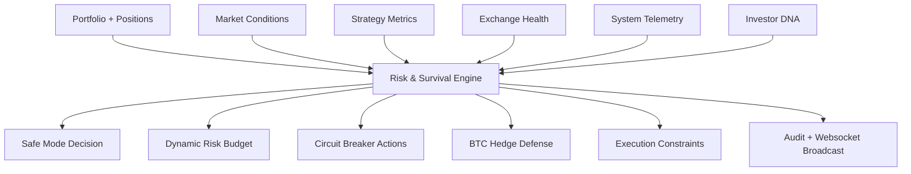
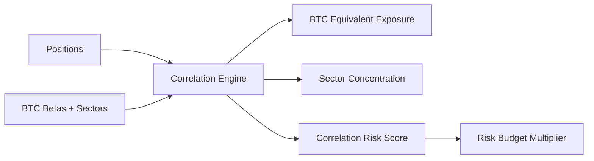
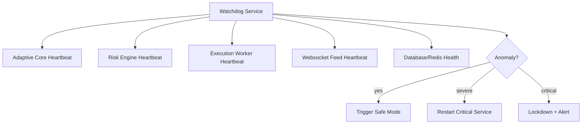

# LAPS HYBRID Risk & Survival Engine

## 1. Mission

The Risk & Survival Engine is the highest-priority protection layer in LAPS HYBRID. It exists to preserve capital, reduce systemic exposure, prevent cascading failures, and enforce defensive behavior across strategies, AI models, copy-trading accounts, and execution services.

The engine has override authority over:

- Strategy selection
- AI confidence outputs
- Position sizing
- Leverage
- Trade frequency
- Copy-trading replication
- Exchange execution
- Hedge defense activation
- Safe-mode and lockdown transitions

Risk policy hierarchy:

```text
SURVIVAL > STABILITY > CONSISTENCY > PROFIT
```

No trade, strategy, investor profile, or AI recommendation may bypass this hierarchy.

## 2. Service and Module Structure

```text
backend/
  laps_hybrid/
    risk_survival/
      __init__.py
      models.py            # Risk state, investor DNA, telemetry, decisions
      engine.py            # Main survival assessment and escalation engine
      circuit_breakers.py  # Emergency breaker evaluation
      correlation.py       # Hidden BTC/sector correlation exposure
      hedge.py             # BTC defense hedge sizing and intent generation
      failsafe.py          # API, websocket, execution, and desync handling
      watchdog.py          # Independent process/service health monitor

docs/
  risk-survival-engine.md
```

Recommended production expansion:

```text
backend/
  laps_hybrid/
    services/
      risk_orchestrator.py          # Runs risk engine as independent service
      exposure_aggregator.py        # Aggregates master/subaccount exposure
      drawdown_monitor.py           # Tracks realized/unrealized drawdown
      liquidation_monitor.py        # Tracks liquidation clusters
    infrastructure/
      exchange/
        health_probe.py             # API, websocket, order-route health
      persistence/
        risk_repository.py          # PostgreSQL risk events and decisions
      cache/
        risk_state_cache.py         # Redis current risk posture
```

## 3. Risk Engine Architecture

The engine continuously converts portfolio, strategy, market, exchange, and system telemetry into an enforceable survival posture.



### Input domains

- **Position risk**: per-symbol notional, leverage, liquidation proximity, unrealized PnL.
- **Strategy risk**: drawdown, win/loss degradation, confidence decay, slippage sensitivity.
- **Portfolio risk**: aggregate exposure, net directional exposure, concentration, drawdown.
- **Exchange risk**: REST errors, websocket disconnects, rejected orders, order latency.
- **Session risk**: high-risk trading sessions, rollover windows, liquidity transitions.
- **Market regime risk**: trend/range/chaos/dead conditions from the Adaptive Core.
- **Correlation risk**: hidden BTC beta, sector clustering, common liquidation paths.
- **Volatility risk**: realized volatility, shock velocity, volatility expansion.
- **Liquidity risk**: spread expansion, order-book depth collapse, slippage.
- **Systemic failure risk**: stale data, desync, frozen processes, cascading errors.

### Output domains

- Safe mode level
- Risk score
- Dynamic leverage multiplier
- Dynamic position-size multiplier
- Max simultaneous trades
- Trade frequency multiplier
- Allowed strategy families
- Circuit breaker actions
- Hedge recommendation
- Failsafe actions
- Audit reason trail

## 4. Dynamic Risk Logic

Risk is adaptive. It contracts as danger rises and expands only after conditions improve.

### Survival state matrix

| State | Purpose | Leverage | Position Size | Trade Frequency | Strategy Access |
| --- | --- | --- | --- | --- | --- |
| NORMAL | Standard controlled operation | Profile baseline | Profile baseline | Profile baseline | All approved strategies |
| CAUTION | Early risk contraction | Reduced | Reduced | Reduced | Strong regime alignment only |
| DEFENSIVE | Capital preservation bias | Low | Small | Low | High-confidence, liquid strategies |
| SURVIVAL | Active protection | Minimal | Minimal | Rare | Hedge/reduce-only bias |
| LOCKDOWN | Stop new risk | Zero for new trades | Zero for new trades | None | Close, hedge, reconcile only |

### Adaptive multipliers

```text
effective_leverage =
  investor_profile_leverage
  * safe_mode_leverage_multiplier
  * market_regime_multiplier
  * drawdown_multiplier
  * exchange_health_multiplier

effective_position_size =
  base_position_budget
  * investor_profile_size_multiplier
  * safe_mode_size_multiplier
  * liquidity_multiplier
  * correlation_multiplier
  * strategy_health_multiplier
```

### Expansion rules

The engine may return from a stricter state only when:

- Market data is fresh.
- Exchange API and websocket health are stable.
- Spread and slippage return below thresholds.
- Drawdown velocity slows.
- Consecutive-loss breaker cools down.
- Portfolio correlation falls below concentration thresholds.
- Position reconciliation confirms exchange/internal state alignment.

Recovery is staged. The engine must move from `LOCKDOWN` -> `SURVIVAL` -> `DEFENSIVE` -> `CAUTION` -> `NORMAL`, never directly from lockdown to normal.

## 5. Safe Mode Architecture

### NORMAL MODE

- Standard approved strategy operation.
- Investor DNA applies normal leverage and exposure caps.
- Risk engine still validates every intent.

### CAUTION MODE

Triggered by early warning conditions:

- Moderate drawdown
- Mild volatility expansion
- Spread deterioration
- Increased API latency
- Strategy performance degradation

Actions:

- Reduce exposure and leverage.
- Reduce trade frequency.
- Require stronger confidence.
- Disable weaker or regime-misaligned strategies.

### DEFENSIVE MODE

Triggered by elevated risk:

- Correlation concentration
- High volatility
- Liquidity thinning
- Consecutive losses
- Exchange instability

Actions:

- Only high-confidence, liquid, low-slippage trades.
- No aggressive averaging.
- Lower simultaneous trade limit.
- Prefer reduce-only exits.

### SURVIVAL MODE

Triggered by severe risk:

- Rapid drawdown
- Liquidation clusters
- Severe volatility spike
- Websocket instability
- Exchange desync risk

Actions:

- Hedge prioritization.
- Reduce portfolio beta.
- No new speculative trades.
- Allow close, reduce, hedge, and reconcile actions.

### LOCKDOWN MODE

Triggered by critical conditions:

- Maximum drawdown breach
- Severe exchange instability
- Liquidity collapse
- Execution mismatch
- Stale market data during active risk
- Unresolved order/account desync

Actions:

- Block all new trades.
- Cancel unsafe open orders.
- Reconcile exchange state.
- Persist incident record.
- Notify operators and external monitoring.

## 6. Circuit Breaker Design

Circuit breakers are deterministic emergency rules that can immediately escalate safe mode.

| Breaker | Signal | Action |
| --- | --- | --- |
| Abnormal Volatility | Realized volatility or shock velocity above threshold | DEFENSIVE/SURVIVAL |
| Exchange API Instability | Error rate or latency spike | SURVIVAL/LOCKDOWN |
| Websocket Failure | Disconnects or stale streams | SURVIVAL/LOCKDOWN |
| Consecutive Losses | Strategy/account loss streak | CAUTION/DEFENSIVE |
| Rapid Drawdown | Drawdown velocity breach | SURVIVAL/LOCKDOWN |
| Liquidity Collapse | Depth collapse or spread expansion | DEFENSIVE/SURVIVAL |
| Excessive Slippage | Fill slippage above model | CAUTION/DEFENSIVE |
| Spread Expansion | Spread beyond safety threshold | DEFENSIVE/SURVIVAL |
| Execution Mismatch | Internal/exchange state divergence | LOCKDOWN |

Breakers emit:

- Name
- Severity
- Target safe mode
- Trigger reason
- Required action
- Cooldown policy

## 7. Correlation Engine Structure

The Correlation Engine treats altcoin exposure as indirect BTC exposure when appropriate.

Inputs:

- Position notionals
- Asset beta to BTC
- Rolling correlation matrix
- Sector tags
- Market regime
- Liquidation intensity

Outputs:

- Portfolio BTC-equivalent exposure
- Sector concentration score
- Hidden BTC dependency score
- Correlation risk score
- Recommended exposure multiplier



Production rules:

- BTC and ETH exposures are treated as systemic core risk.
- Highly correlated alt baskets cannot be treated as diversified.
- Sector concentration increases under chaos regimes.
- Correlation risk reduces position size before trade approval.

## 8. BTC Defense Hedge Flow

The BTC Defense Hedge is activated when the portfolio has high hidden BTC beta during systemic deterioration.

### Hedge activation triggers

- Chaos regime
- Rapid drawdown
- BTC dominance shock
- Liquidation clusters
- High portfolio BTC-equivalent exposure
- Sector-wide altcoin correlation spike

### Hedge sizing principles

- Hedge is proportional to BTC-equivalent exposure and danger score.
- Hedge does not over-neutralize unless lockdown rules require full protection.
- Hedge can be partial and staged.
- Hedge intent is still audited and reconciled.

```text
hedge_notional =
  btc_equivalent_exposure
  * hedge_intensity
  * safe_mode_multiplier
```

### Hedge flow

```text
systemic_risk.detected
  -> correlation_risk.assessed
  -> hedge_intensity.calculated
  -> btc_hedge_intent.created
  -> risk_engine.validates_reduce_or_hedge_action
  -> execution_gateway.submits_hedge
  -> position_validator.reconciles
```

## 9. Failsafe Flow

Failsafe logic handles operational failure before it becomes trading loss.

### Failure classes

- API failure
- Websocket disconnect
- Stale market data
- Execution mismatch
- Order rejection
- Delayed execution
- Exchange account desync

### Failsafe action ladder

```text
observe -> classify -> throttle -> safe mode -> reconcile -> hedge/reduce -> lockdown
```

### Example: stale market data

```text
market_data.stale
  -> block_new_entries
  -> switch_to_survival_or_lockdown
  -> cancel_stale_signal_orders
  -> request_websocket_resubscribe
  -> reconcile_positions
```

### Example: execution mismatch

```text
order_state.mismatch
  -> stop_new_orders
  -> fetch_exchange_open_orders
  -> fetch_exchange_positions
  -> compare_internal_state
  -> cancel_unknown_orders
  -> emit_incident
  -> remain_lockdown_until_resolved
```

## 10. Watchdog Architecture

The Watchdog is independent from the trading engine. It monitors engine liveness and escalates safe mode if core services freeze or drift.



Responsibilities:

- Detect frozen processes.
- Detect heartbeat gaps.
- Detect execution anomalies.
- Detect queue backlog.
- Detect Redis/PostgreSQL connectivity degradation.
- Restart non-stateful critical services where safe.
- Trigger safe mode or lockdown where restart is unsafe.

The watchdog must run with minimal dependencies and must not rely on the Adaptive Core being healthy.

## 11. Event Handling Flow

Every risk decision emits immutable events:

```text
risk.telemetry.received
risk.safe_mode.changed
risk.breaker.triggered
risk.budget.updated
risk.hedge.recommended
risk.failsafe.triggered
risk.lockdown.entered
risk.lockdown.cleared
```

Event consumers:

- Audit log
- Websocket status streams
- Operator notification service
- Adaptive Core constraints
- Copy Trading Engine
- Investor reporting
- AI learning systems

Events must include:

- Correlation ID
- Account/investor scope
- Trigger source
- Previous state
- New state
- Required actions
- Human-readable reason
- Raw telemetry snapshot hash or reference

## 12. Risk Escalation Hierarchy

```text
NORMAL
  -> CAUTION
    -> DEFENSIVE
      -> SURVIVAL
        -> LOCKDOWN
```

Escalation is immediate when a severe breaker fires.

De-escalation is controlled and staged:

```text
LOCKDOWN
  -> SURVIVAL after reconciliation and operator/automated clearance
  -> DEFENSIVE after stable exchange and market data window
  -> CAUTION after risk metrics normalize
  -> NORMAL after full cooldown completion
```

### Authority order

1. Lockdown circuit breakers
2. Failsafe engine
3. Risk & Survival Engine
4. Investor DNA constraints
5. Adaptive Core risk gate
6. AI confidence engine
7. Strategy engine

## 13. Investor DNA

Investor DNA adjusts risk ceilings but never bypasses global safety.

| Profile | Leverage | Drawdown Tolerance | Exposure | Frequency |
| --- | --- | --- | --- | --- |
| Conservative | Lowest | Lowest | Lowest | Lower |
| Balanced | Moderate | Moderate | Moderate | Moderate |
| Aggressive | Highest allowed | Higher but capped | Higher but capped | Higher but throttled |

Rules:

- Conservative investors enter stricter safe modes earlier.
- Aggressive investors can receive larger budgets only in normal/caution states.
- All profiles collapse to defensive budgets under survival and lockdown.
- Copy-trading subaccounts inherit master signals only after investor DNA reduces or denies exposure.

## 14. Database Planning

Recommended PostgreSQL tables:

### `risk_state_snapshots`

- `id`
- `account_id`
- `investor_id`
- `safe_mode`
- `risk_score`
- `leverage_multiplier`
- `position_size_multiplier`
- `trade_frequency_multiplier`
- `max_simultaneous_trades`
- `reasons`
- `created_at`

### `risk_circuit_breaker_events`

- `id`
- `breaker_name`
- `severity`
- `safe_mode_target`
- `trigger_value`
- `threshold`
- `action`
- `correlation_id`
- `created_at`

### `correlation_risk_snapshots`

- `id`
- `portfolio_id`
- `btc_equivalent_exposure`
- `hidden_btc_dependency`
- `sector_concentration`
- `correlation_risk_score`
- `recommended_multiplier`
- `created_at`

### `hedge_recommendations`

- `id`
- `portfolio_id`
- `symbol`
- `side`
- `notional`
- `intensity`
- `reason`
- `status`
- `created_at`

### `failsafe_incidents`

- `id`
- `incident_type`
- `severity`
- `safe_mode_target`
- `affected_service`
- `action`
- `resolved_at`
- `created_at`

## 15. Suggested Implementation Roadmap

1. Define risk telemetry contracts and safe mode enums.
2. Implement investor DNA profiles and baseline risk budgets.
3. Implement deterministic survival scoring.
4. Implement circuit breakers for volatility, drawdown, websocket staleness, exchange instability, spread, and execution mismatch.
5. Implement dynamic risk budget outputs consumed by Adaptive Core.
6. Implement correlation engine with BTC-equivalent exposure and sector concentration.
7. Implement BTC hedge defense recommendations.
8. Implement failsafe action classification.
9. Implement independent watchdog heartbeats.
10. Persist risk snapshots and breaker events.
11. Stream safe-mode and breaker events via websocket.
12. Integrate copy-trading investor risk constraints.
13. Add exchange-specific health probes and reconciliation.
14. Add operator dashboards and incident review workflows.
15. Add model-assisted anomaly detection after deterministic safety rules are stable.

## 16. Production Readiness Rules

- No strategy can increase risk budget.
- No AI model can override a circuit breaker.
- No investor profile can bypass lockdown.
- No new trade is allowed with stale market data.
- No new trade is allowed during unresolved execution desync.
- Shadow strategies cannot influence live exposure except through reviewed promotion.
- Every escalation and de-escalation must be audited.
- Every hedge recommendation must include sizing rationale.
- Every exchange order path must support idempotency and reconciliation.
- Watchdog and failsafe services must be operationally independent from strategy execution.
